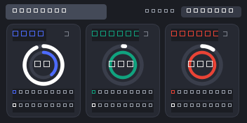

# API Usage Monitor

A compact desktop widget that shows remaining quota for **Kimi**, **ChatGPT (Codex)** and **Antigravity** at a glance.



## Features

- **Dual progress rings** per service — outer ring: long-period quota (week/month), inner ring: 5-hour window. Ring fill = quota *remaining* (matches what the Antigravity IDE shows).
- **Small legend** under each ring with the remaining percent and next reset time.
- **Service selector**: the `+ Select` dropdown lists all services with checkboxes — click a row to show/hide its card. Your selection is remembered in `~/.api-usage-monitor.json`.
- Auto-refresh every 60 s, manual `Refresh` button, per-card error states.
- Hover a card for detailed numbers (plan type, absolute counts, per-model quotas).

## Data sources

All credentials are read locally and only sent to each service's own first-party endpoints.

| Service | Source |
| --- | --- |
| Kimi | OAuth credentials from `~/.kimi-code/credentials/kimi-code.json` → `GET https://api.kimi.com/coding/v1/usages` (token auto-refresh via `auth.kimi.com`) |
| ChatGPT | Codex login from `~/.codex/auth.json` → `GET https://chatgpt.com/backend-api/wham/usage` (token auto-refresh via `auth.openai.com`) |
| Antigravity | Local Language Server Connect RPC (`GetUserStatus`) discovered via the running IDE process — the IDE must be open |

## Run from source

```sh
uv sync
uv run python main.py
```

## Build the exe

```sh
uv run python make_icon.py   # regenerate icon.ico (optional)
uv run pyinstaller --onefile --windowed --icon icon.ico --add-data "icon.ico;." --name APIUsageMonitor main.py
# output: dist/APIUsageMonitor.exe
```
